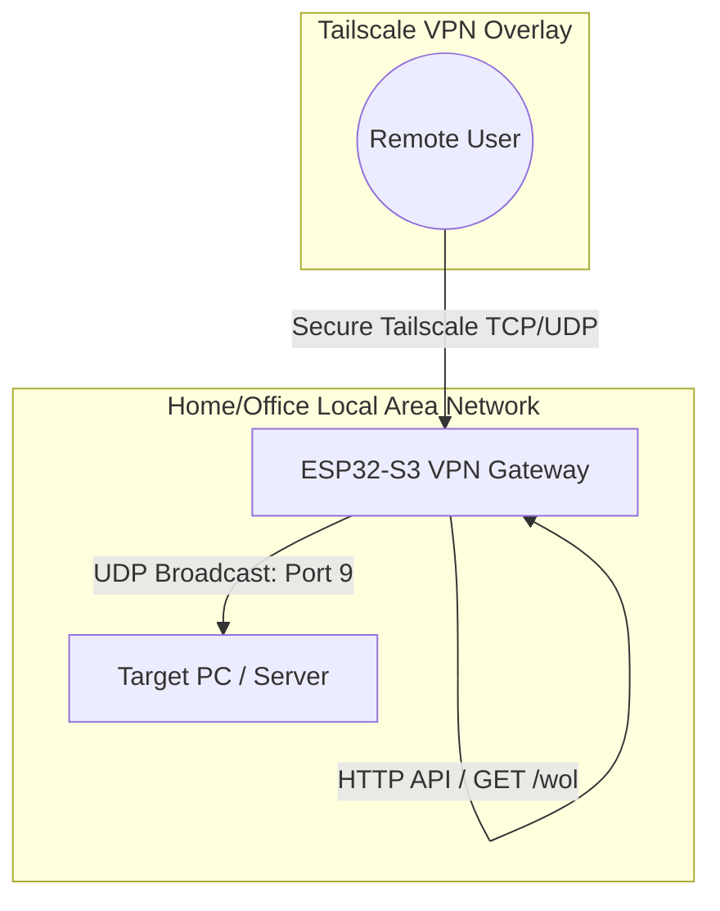

# ESP32 Tailscale VPN Gateway & Wake-on-LAN (WoL)

This project is a lightweight, low-cost ESP32-S3 firmware that connects directly to a Tailscale network (tailnet) as a secure VPN gateway node and exposes a Wake-on-LAN (WoL) API. It allows residents or administrators to securely wake up computers in their local network remotely by hitting an HTTP endpoint over the encrypted Tailscale network.

---

## ✨ Features

- **Tailscale on Microcontrollers**: Utilizes the **MicroLink** library, a custom port of Tailscale to FreeRTOS/ESP32, avoiding the overhead of running full Linux containers.
- **Embedded Web Server**: Runs a lightweight HTTP server on port 80 over the Tailscale VPN interface.
- **Wake-on-LAN API**: Triggers Magic Packets (UDP port 9) to boot up offline workstations or servers in the local subnet via `GET /wol?mac=AA:BB:CC:DD:EE:FF`.
- **WireGuard Networking**: Encapsulates packets directly using WireGuard and lwIP integration.
- **Optimized for ESP32-S3**: Configured to run on dual-core processors utilizing external PSRAM (8MB Octal SPI) for high network throughput.

---

## 🏗️ Architecture Stack



- **Firmware Framework**: ESP-IDF v5.3.
- **Vpn Core**: Custom WireGuard + lwIP stack.
- **Security Protocols**: Tailscale coordination (Noise, STUN, DERP) and NaCl Box / x25519 cryptography.
- **Hardware Profile**: ESP32-S3 with PSRAM (e.g., ESP32-S3-N16R8).

---

## 🚀 Quickstart & Setup

### 1. Prerequisites
- **ESP-IDF v5.3** environment installed.
- **ESP32-S3 with PSRAM** (e.g., ESP32-S3-N16R8: 16MB Flash, 8MB PSRAM).
- **Tailscale Auth Key** (reusable or ephemeral) created in the Tailscale admin console.

### 2. Configuration
Edit configuration definitions in `main/main.c` or use menuconfig:
- `WIFI_SSID`: Your local WiFi SSID.
- `WIFI_PASSWORD`: Your WiFi password.
- `TS_AUTH_KEY`: Your Tailscale reusable auth key (`tskey-auth-...`).
- `LAN_BROADCAST`: Your local subnet broadcast address (e.g., `192.168.1.255`).

### 3. Build & Flash
Run standard ESP-IDF build commands:
```bash
# Set build target
idf.py set-target esp32s3

# Build application
idf.py build

# Flash and monitor output
idf.py -p COM3 flash monitor
```

---

## 🔑 Exposed API & Usage

Once connected, the ESP32 will register with Tailscale and log its VPN IP (e.g. `100.115.12.34`).

### Wake-on-LAN Command
Send an HTTP GET request to the ESP32's VPN IP to boot up a device:
```bash
curl "http://100.115.12.34/wol?mac=AA:BB:CC:DD:EE:FF"
```
The ESP32 will construct a magic packet (6 bytes of `0xFF` followed by the MAC address repeated 16 times) and broadcast it over UDP Port 9 on the LAN.
