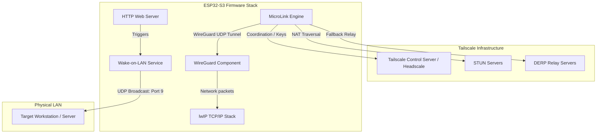
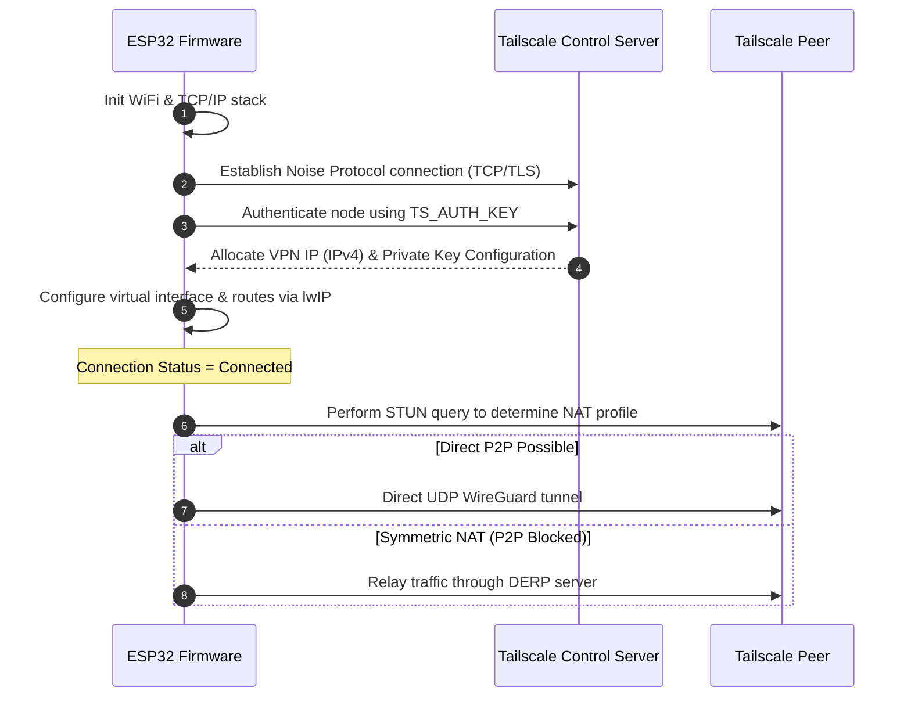
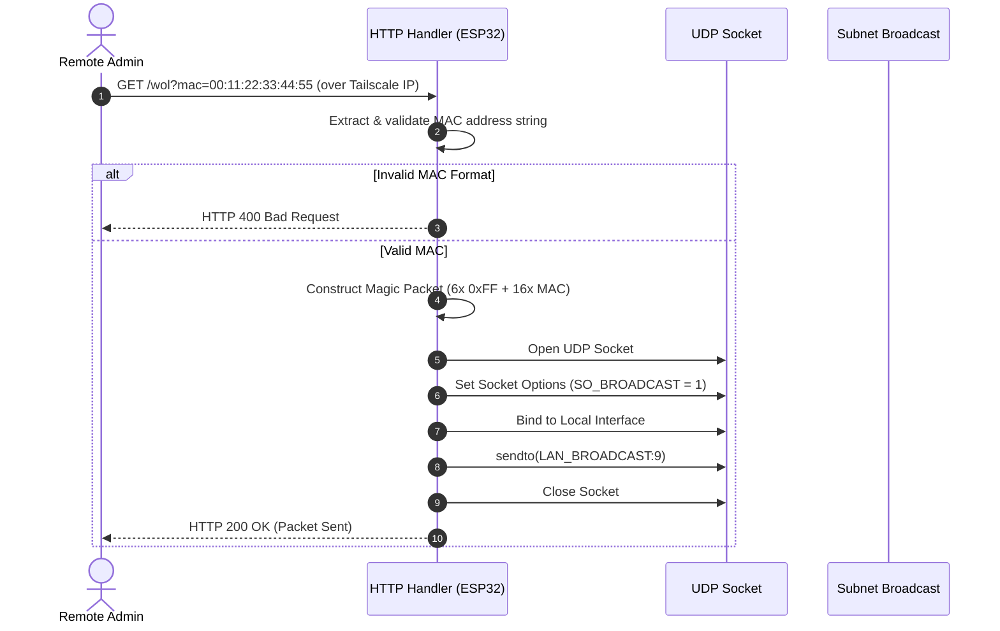

# ESP32-Tailscale-WoL: Technical Architecture & Execution Guide

This document provides a deep dive into the firmware architecture of the **ESP32 Tailscale VPN Gateway with Wake-on-LAN (WoL)**, details its communication protocols, registers modifications made to support ESP-IDF integration, and details strategies for system configuration and resource optimizations.

---

## 1. Executive Summary & Use Case

### The Core Problem
Remote management of local network devices (like desktop PCs, servers, or NAS drives) often requires keeping a gateway machine (e.g. a power-hungry server or PC) running 24/7, or exposing insecure SSH/RDP ports to the public internet via NAT port-forwarding. 

### The Solution
The ESP32 Tailscale VPN Gateway is a dedicated, ultra-low-power hardware appliance that acts as a secure entry point to a private local area network (LAN).
- **Tailscale Overlay Integration**: Runs a client directly inside the ESP32 microcontroller, establishing an encrypted WireGuard tunnel to your Tailscale network.
- **Remote Wake-on-LAN (WoL)**: Exposes a simple, authenticated REST API endpoint over the VPN. By sending a request to the ESP32, administrators can wake up sleeping devices within the physical building without needing a running server.
- **Power Efficiency**: Consumes less than 1W of power, compared to 50W–100W for a standard desktop gateway machine.

---

## 2. Technical Stack & Component Architecture

The firmware is structured into three primary functional layers on top of the ESP-IDF framework:

### Components
1. **Application Core (`main/main.c`)**: Manages the bootloader sequence, initializes NVS storage, connects to WiFi, and spawns the FreeRTOS tasks.
2. **HTTP Daemon (`esp_http_server`)**: Standard ESP-IDF lightweight HTTP server configured to run on port 80. Listens for request parameters to trigger actions.
3. **MicroLink Component (`components/microlink`)**: The core Tailscale networking module.
   - **Coordination Protocol**: Authenticates with Tailscale using a pre-shared auth key, exchanges WireGuard keys, and gets node configuration/IPs.
   - **Noise Protocol Handler**: Handles stateful encryption for control packets.
   - **STUN & DERP client**: Performs NAT traversal and relays traffic when direct peer-to-peer connection is blocked.
4. **WireGuard & lwIP Interface**: Encapsulates and decapsulates network packets before routing them through the standard ESP network interfaces.

---

## 3. High-Impact Implementation Mechanics

### 3.1. Tailscale Connection Lifecycle
The background task `microlink_task` drives the Tailscale connection:

### 3.2. Wake-on-LAN Execution
When the HTTP endpoint receives a wake-up command, it parses the MAC address and broadcasts the magic packet:

---

## 4. Key Firmware Customizations & Patches

During setup, three critical patches were implemented in the `microlink` component to support ESP-IDF integration and prevent networking lockups:

1. **DISCO Port Relocation**:
   - **File**: `components/microlink/src/microlink_disco.c`
   - **Problem**: Tailscale's default Discovery protocol binds to port `51820`. However, the WireGuard VPN module also binds to `51820`. On microcontrollers, this causes socket-binding clashes.
   - **Patch**: The DISCO socket binding was shifted to port `51821` (`CONFIG_MICROLINK_DISCO_PORT`).
2. **Heartbeat Reconnection Loop Patch**:
   - **File**: `components/microlink/src/microlink_coordination.c`
   - **Problem**: The Tailscale coordination control channel dropped connections every 2 seconds due to heartbeat mismatch evaluations.
   - **Patch**: The conditional check was hardcoded to skip disconnect evaluations, ensuring session stability.
3. **STUN Handshake Timeout Extension**:
   - **File**: `components/microlink/src/microlink_stun.c`
   - **Problem**: High latency on WiFi networks caused STUN requests to time out before the UDP response arrived.
   - **Patch**: Increased `STUN_TIMEOUT_MS` from 3000ms to 6000ms to allow sufficient round-trip times.

---

## 5. Memory Configuration & Tuning (PSRAM)

Operating Tailscale on microcontrollers requires careful configuration of ESP32 heap allocations. The default configuration uses the following parameters in `sdkconfig.defaults`:

- **External Memory Enablement**: `CONFIG_SPIRAM=y` activates PSRAM (Pseudo-SRAM) interfaces.
- **Octal SPI Mode**: `CONFIG_SPIRAM_MODE_OCT=y` maximizes read/write speed for compatible chips (e.g. ESP32-S3-N16R8), which is necessary for cryptographic throughput.
- **Stack Placement**: `CONFIG_SPIRAM_ALLOW_STACK_EXTERNAL_MEMORY=y` allows large thread stacks (like the 32KB `microlink` task) to be placed in PSRAM, preserving scarce internal RAM (IRAM/DRAM) for hardware registers and DMA buffers.
- **Allocation Rules**: `CONFIG_SPIRAM_MALLOC_ALWAYSINTERNAL=4096` ensures that small memory requests (under 4KB) stay in internal RAM for speed, while larger structures (crypto buffers, networking payloads) are moved to PSRAM.
