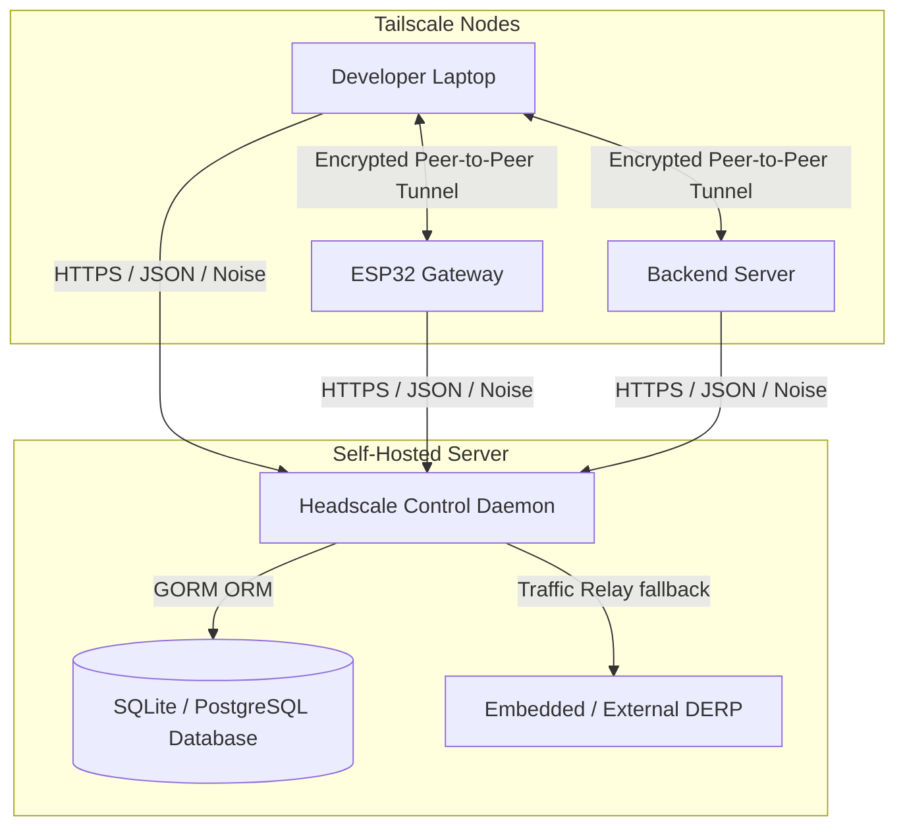

# Headscale: Self-Hosted Tailscale Control Server

Headscale is an open-source, self-hosted alternative to the proprietary Tailscale SaaS coordination server. It acts as a central exchange point for WireGuard public keys and network metadata, enabling you to build private, secure, and sovereign Tailscale networks (tailnets) on your own infrastructure.

---

## ✨ Features

- **Sovereign Control Plane**: Keeps all network metadata, node information, and cryptographic keys under your control.
- **WireGuard Key Exchange**: Automatically coordinates WireGuard public keys, endpoints, and routing tables between registered nodes.
- **NAT Traversal Assistance**: Directs nodes to STUN and DERP (relaying) servers to facilitate direct peer-to-peer connections even behind restrictive NATs.
- **Multi-user Support**: Partitions devices into namespaces/users to control network boundaries.
- **OpenID Connect (OIDC) Integration**: Authenticates users using external identity providers (Keycloak, Okta, Authentik, Google Workspace).
- **Flexible Database Backend**: Supports SQLite for lightweight setups, and PostgreSQL/CockroachDB for highly available enterprise deployments.
- **Command Line Interface (CLI) & gRPC API**: Complete CLI commands for node registration, user management, policy updates, and API key generation.

---

## 🏗️ Architecture Stack



- **Core Engine**: Go (Golang).
- **Communication Security**: Noise protocol over HTTP (with TLS).
- **API Interfaces**: gRPC and RESTful JSON endpoints.
- **Persistence Layer**: GORM (Go Object Relational Manager) connecting to SQLite or PostgreSQL.

---

## 🚀 Quickstart Installation

### 1. Configuration
Copy the template configuration file:
```bash
cp config-example.yaml config.yaml
```
Edit `config.yaml` to specify your public server URL, IP allocation ranges (IPv4/IPv6 subnets), and database configuration.

### 2. Running the Daemon
Run the server using Go or container images:
```bash
# Start Headscale server
headscale serve
```

### 3. Registering Users & Nodes
Create a namespace/user:
```bash
headscale users create mynet
```

Generate a pre-authenticated key to register a device:
```bash
headscale preauthkeys create -u mynet --reusable --expiration 24h
```

On your client device, connect by pointing to your Headscale instance:
```bash
tailscale up --login-server http://your-headscale-ip:8080 --authkey <preauthkey>
```
