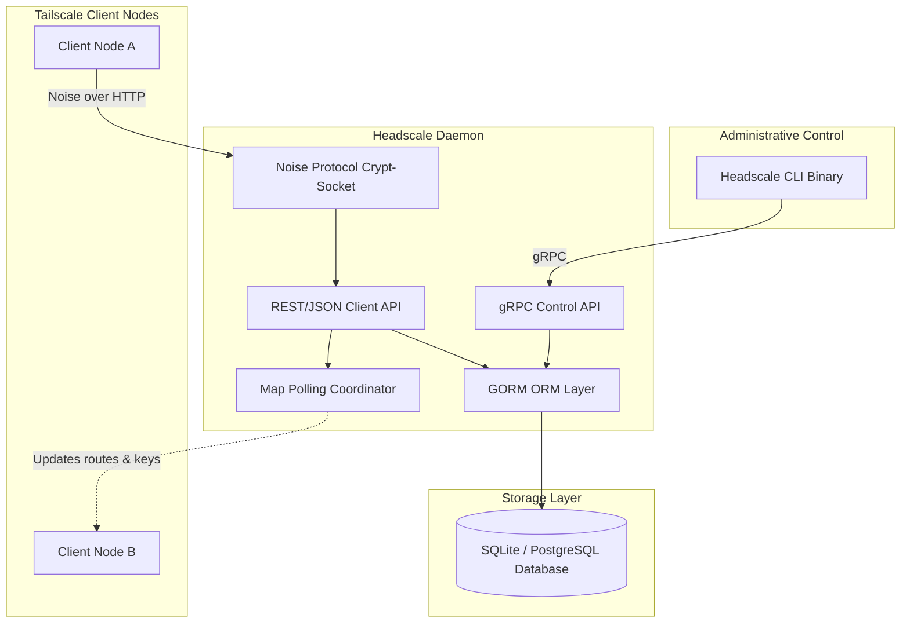
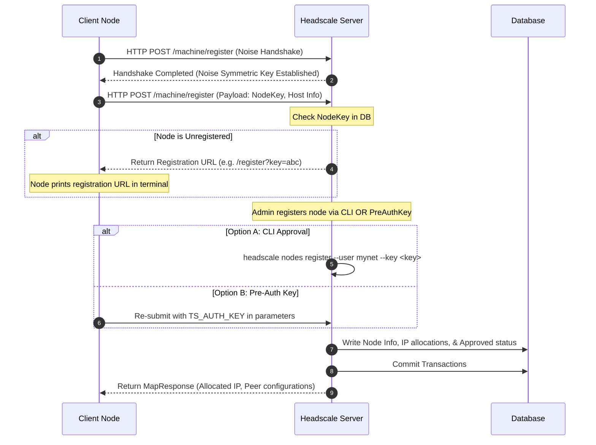
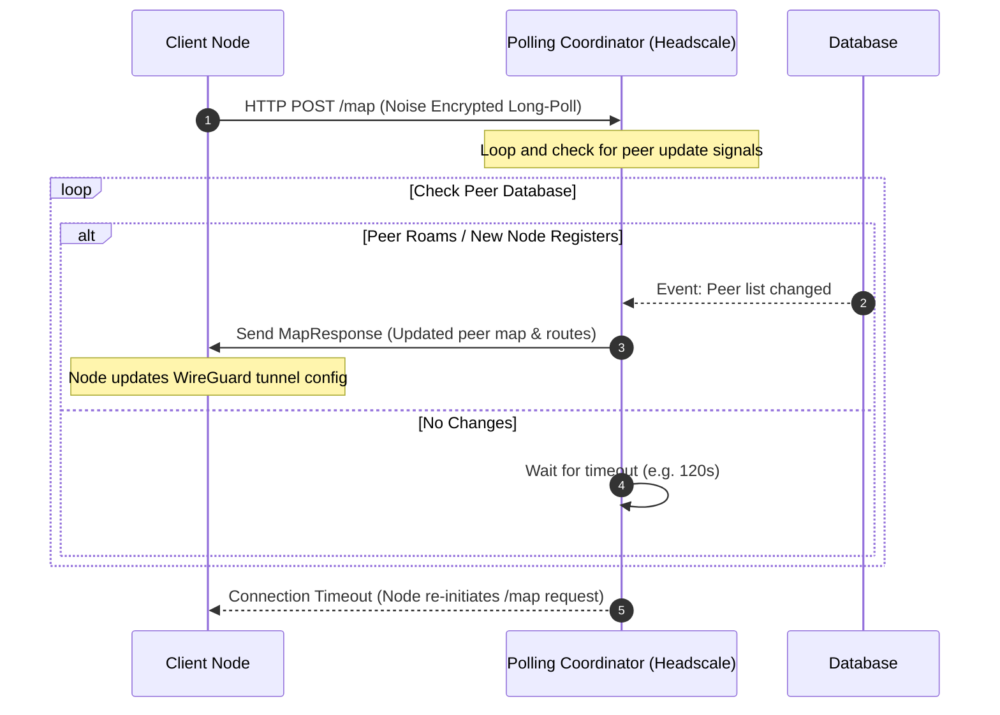

# Headscale: Technical Architecture & Design Guide

This document provides a comprehensive analysis of the **Headscale** self-hosted Tailscale control server, mapping out its functional layers, security mechanisms, API flows, and persistence schemas.

---

## 1. Executive Summary & Core Value Proposition

In the standard Tailscale architecture, node keys, authentication states, and routing tables are managed by the proprietary Tailscale SaaS coordination server. For users prioritizing complete data ownership, network sovereignty, or absolute offline reliability, Headscale replaces this cloud control plane.

### Key Value Pillars
1. **Self-Hosted Control Plane**: Node public keys, IP addresses, and private configurations are stored strictly within a self-managed database.
2. **Standard Compatibility**: Supports the official Tailscale client binaries across Linux, Windows, macOS, Android, iOS, and embedded environments.
3. **No External Dependencies**: Operates entirely offline without requiring connection to Tailscale Inc. servers.

---

## 2. Technical Stack & Architectural Layers

Headscale is structured into three primary operational blocks:

### Layer 1: The Cryptographic Security Layer (Noise & TLS)
- Tailscale client communications use the **Noise Protocol** over HTTP. Headscale intercepts these requests, decrypts payloads using the server's machine key, and verifies signatures before passing them to internal routers.
- Secure Noise sessions protect transit payloads from tampering, even if running over plain HTTP.

### Layer 2: Node Registration & Coordination APIs
- **Client REST Router**: Handles map requests, key exchanges, and client state updates.
- **Polling Loop Coordinator**: Keeps open HTTP long-polling channels (`MapRequest`) to push realtime networking updates (peer registration changes, IP updates, route modifications) directly to online clients.

### Layer 3: Administration (CLI & gRPC)
- Exposes a robust gRPC interface on a configurable port. The `headscale` CLI binary communicates with the server daemon over gRPC, enabling administrators to manage users, nodes, preauthkeys, and routing rules.

---

## 3. High-Impact Mechanics & Execution Flows

### 3.1. Node Registration (Noise Handshake & Registration)
When a new node joins the network, it must register and authenticate:

### 3.2. Real-Time Network Mapping (Long Polling MapRequest)
To maintain connectivity when devices move behind NATs or change public IPs, Headscale maintains dynamic mapping state channels:

---

## 4. Key Security & Boundary Policies

1. **User Segregation (Namespaces)**:
   - Headscale implements strict database segregation. Nodes belonging to different users cannot see or communicate with each other unless explicit sharing configurations or routing policies are defined.
2. **Access Control Lists (ACLs) & Policies**:
   - Access policies are defined via YAML/JSON documents matching the Tailscale ACL syntax.
   - Headscale compiles these rules to filter which nodes receive WireGuard configuration maps, restricting IP routing paths directly at the WireGuard layer.
3. **Route Approval Controls**:
   - Nodes can advertise local subnets or exit routes (e.g. `10.0.0.0/24`, `0.0.0.0/0`).
   - By default, Headscale blocks route advertisements. Admins must explicitly authorize route propagation using CLI commands (`headscale routes enable`) to protect networks from rogue gateway hijacking.
