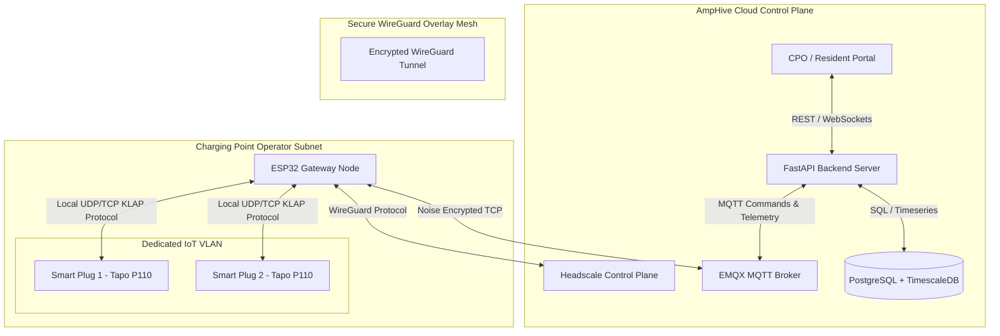

# AmpHive: Shared EV Charging Platform
## Product Requirements & Technical Architecture Specification

This document details the functional requirements, system architecture, security framework, and engineering roadmap for **AmpHive**, a multi-tenant PaaS platform enabling shared electric vehicle (EV) charging via 3rd-party smart plugs managed by ESP32 Edge Gateways.

---

## 1. Executive Summary & Core Concept

**AmpHive** is an enterprise-grade Software-as-a-Service (SaaS) and Platform-as-a-Service (PaaS) solution that transforms generic, off-the-shelf, energy-monitoring smart plugs (e.g., TP-Link Tapo P110, Shelly, Sonoff) into a secure, monetizable, shared EV charging network.

### The Problem
- **High Infrastructure Cost:** Installing dedicated commercial Level 2/3 chargers (OCPP-compliant) requires thousands of dollars in hardware, permitting, and electrical upgrades.
- **Unused Capacity:** Many residents and small businesses have accessible outdoor/garage outlets but lack a way to securely share, monitor, and monetize them.
- **Security & NAT Barriers:** Directly connecting local smart plugs to a central cloud server requires configuring port forwarding or exposing internal subnets, introducing major security vulnerabilities.

### The AmpHive Solution
- **Ultra-low-cost Gateways:** A low-cost **ESP32 microcontroller** is deployed at each site (garage/building) to act as an edge network gateway.
- **Zero-Config VPN Tunnels:** The ESP32 runs an embedded WireGuard client that connects to AmpHive's self-hosted **Headscale** control plane. This establishes a secure, encrypted overlay network between the AmpHive central cloud and the edge, bypassing NATs and firewalls completely.
- **Local Isolation:** The smart plugs and gateways are segregated onto dedicated **local VLANs** at the physical site to prevent any lateral network intrusion.
- **Centralized PaaS Billing:** Drivers scan a QR code on a charging bay to authenticate, start a session, and pay via a virtual wallet. The central platform coordinates plug commands and logs timeseries telemetry.

---

## 2. System Architecture

The AmpHive platform is structured into three primary tiers: **Central Cloud Control Plane**, **Edge Gateway Layer (ESP32)**, and **Local Smart Plug Hardware**.



### Component Details

| Component | Technology | Description |
| :--- | :--- | :--- |
| **Central PaaS API** | FastAPI / Python 3.11 | Handles core business logic, session orchestration, user profiles, billing/wallet ledgers, and CPO configuration. |
| **VPN Control Plane** | Headscale (Go) | Self-hosted coordination server that configures and manages the private WireGuard mesh network, distributing cryptographic keys and routes. |
| **Message Broker** | EMQX / Mosquito (MQTT) | Facilitates bidirectional, low-overhead communication between the central server and ESP32 gateways over the VPN. |
| **Database Engine** | PostgreSQL + TimescaleDB | PostgreSQL stores transactional and user data; TimescaleDB ingestion stores high-velocity power/energy telemetry. |
| **Edge Gateway** | ESP32-S3 (ESP-IDF / C) | Low-power microcontroller running an embedded Tailscale/WireGuard client (e.g., MicroLink), bridging MQTT commands to local smart plug protocols. |
| **Smart Plugs** | Tapo P110 / Shelly / Sonoff | Budget-friendly smart plugs with internal energy meters, running on the local network. |

---

## 3. Data Security & Isolation Model

Data security is implemented at two distinct layers: the **Local Physical Network (VLANs)** and the **Virtual Overlay Network (Headscale / WireGuard)**.

### 3.1. Local Site Isolation: VLAN Segmentation (Physical Security)
Charging Point Operators (CPOs) install smart plugs and gateways on a dedicated physical network segment to prevent lateral movement to private corporate or residential devices.

### Plug Availability Options

- **Publicly Available Plugs** – Plugs that can be discovered and used by any registered user. Their location is shown on a map and they are listed in the marketplace.

- **Private Plugs** – Restricted to specific groups:
  - *Personal*: Owned by an individual user.
  - *Society*: Shared within a residential society or community.
  - *Office*: Limited to a corporate office environment.

> **Note:** No QR code scanning is required. Users simply enter the printed Plug ID into the mobile app or web portal to start a charging session.

> **Mapping:** Operators can upload photos of the plug installation and its exact address. The app displays the plug location using **OpenStreetMap**, allowing users to navigate to the site with visual instructions.

```
                  ┌──────────────────────┐
                  │  CPO Internet Router │
                  └──────────┬───────────┘
                             │
            ┌────────────────┴────────────────┐
            ▼ (VLAN 10: Private Net)          ▼ (VLAN 20: EV IoT Net)
  ┌───────────────────┐             ┌───────────────────┐
  │ Resident/Staff PC │             │   ESP32 Gateway   │
  │ Home Smart TV     │             │ Smart Plug (Tapo) │
  └───────────────────┘             └───────────────────┘
            │                                 │
            └── [ Firewall Blocks Traffic ] ◄─┘
```

### Operator Account Types

- **Super Admin** – Full read/write access to all CPOs, plug inventories, and system configurations.
- **CPO Admin** – Manage plugs, users, and billing within their own organization. Can create, edit, and deactivate private plug groups (Personal, Society, Office).
- **Operator** – Limited to viewing plug status and performing start/stop actions. Cannot modify configurations.
- **Viewer** – Read‑only access to dashboards and analytics.

> Operators can easily switch between account types via the web portal settings, enabling rapid updates to permissions without code changes.
```

#### Local VLAN Rules
1. **IoT Segregation:** The CPO router is configured with **VLAN 20 (EV-IoT)**. All smart plugs and the ESP32 Gateway are assigned to this VLAN.
2. **Access Control Lists (ACLs) on Router:**
   - **Allowed:** VLAN 20 is permitted outbound traffic to the Internet (necessary for the ESP32 to establish its WireGuard connection to the central Headscale server).
   - **Blocked:** All inbound and outbound traffic between VLAN 20 and VLAN 10 (main residential/office network) is strictly dropped by the router's firewall.
3. **No Direct External Ports:** No port forwarding is configured on the router. The network is completely closed to inbound traffic from the public internet.

---

### 3.2. Virtual Network Isolation: Headscale ACLs (Overlay Security)
Once the ESP32 gateway connects to the Headscale VPN, it receives a virtual private IP (e.g., `100.64.0.5`). To prevent gateways from scanning or attacking other gateways, strict Access Control Lists (ACLs) are configured on the Headscale server.

#### Example Headscale ACL Policy (`acl.hujson`)
```json
{
  // Define groups and tags
  "groups": {
    "group:admin": ["admin@amphive.com"]
  },
  "hosts": {
    "amphive-server": "100.64.0.1"
  },
  "tagOwners": {
    "tag:gateway": ["group:admin"]
  },

  // Access control rules
  "acls": [
    // Rule 1: The Central API Server can talk to all Gateways
    {
      "action": "accept",
      "src": ["amphive-server"],
      "dst": ["tag:gateway:*"]
    },
    // Rule 2: Gateways can talk to the Central API Server (for MQTT/API requests)
    {
      "action": "accept",
      "src": ["tag:gateway"],
      "dst": ["amphive-server:*"]
    }
    // Note: Gateways are NOT allowed to communicate with each other (No Peer-to-Peer between gateways)
  ]
}
```

---

## 4. Architectural Suggestions & Refinements

To ensure AmpHive is a robust, reliable, and commercially viable platform, the following design improvements are highly recommended (excluding third‑party integrations & AI):

- **Push / SMS notifications** for session start‑stop, low‑balance alerts, and fault conditions.
- **QR‑free plug lookup** within the app (search by Plug ID, map view, autocomplete).
- **Responsive mobile‑first UI** built with **React + Vite**, featuring dark‑mode and theming.
- **Real‑time energy dashboards** using **Grafana + TimescaleDB**.
- **Historical usage reports** with CSV/Excel export.
- **Dynamic pricing** (time‑of‑day / zone‑based rates) and **load‑balancing throttling**.
- **Expanded payment gateways** (Adyen, PayPal, local UPI) and automated invoicing.
- **Role‑Based Access Control (RBAC)** UI for flexible permission management.
- **Audit log service** stored in Cloud Logging for compliance.
- **Over‑the‑air firmware updates** for ESP32 gateways and Wi‑Fi onboarding captive portal.
- **Support for additional plug models** (Shelly, Sonoff, etc.).
- **OpenStreetMap integration** with photo uploads, plug clustering, and “find nearest plug” API.
- **Geofencing alerts** when a vehicle enters/exits a plug zone.
- **Bulk plug provisioning** via CSV upload.
- **Automated health checks** for VPN, MQTT, and database with Slack/Email alerts.
- **SLA dashboard** (uptime, latency, error rates).
- **Self‑service CI/CD pipeline** (GitHub Actions → Cloud Build) and versioned runbooks.
- **Feature‑flag framework** for safe rollout of new capabilities.

### Suggestion A: MQTT Bidirectional Messaging (Instead of HTTP over VPN)
Exposing an HTTP Web Server directly on the ESP32 (as seen in some basic setups) consumes significant RAM and makes the firmware vulnerable to request-overflow crashes.
- **Recommendation:** Utilize a lightweight **MQTT client** on the ESP32.
- **Flow:**
  - The ESP32 connects to the central MQTT broker over the VPN.
  - The gateway subscribes to a command topic: `gateways/{gateway_id}/plugs/+/command`.
  - The backend issues commands (e.g., `{"state": "ON", "session_id": "abc"}`) to this topic.
  - Telemetry is published by the ESP32 to `gateways/{gateway_id}/plugs/{plug_id}/telemetry` every 10–30 seconds.
- **Benefits:** Low power consumption, native keep-alives, connection re-establishment, and multiplexing command transmissions over a single socket connection.

### Suggestion B: Local Cache & Edge Fail-Safe State
If the internet drops or the VPN disconnects during an active charging session, the platform must prevent two hazards: **infinite free charging** (plugs stuck ON) and **accidental overcharging/fire risks**.
- **Recommendation:** The ESP32 must maintain a **Local Session Register** in its Non-Volatile Storage (NVS).
- **Behavior:**
  - When starting a session, the server passes a config: `{"max_duration_seconds": 14400, "max_kwh": 30.0}`.
  - The ESP32 stores this state locally.
  - If the connection to the server drops, the ESP32 continues to poll the smart plug locally.
  - If the session duration exceeds `max_duration_seconds` or the plug reports energy consumption exceeding `max_kwh`, the ESP32 issues a local `OFF` command to the plug automatically.
  - Once connection is restored, the ESP32 syncs the cached offline telemetry logs.

### Suggestion C: Continuous High-Load Safety Protections
Electric vehicle charging represents a **continuous high-power draw** (typically 8–16 hours at maximum capacity). Standard home smart plugs are easily damaged or melted if run at their peak ratings continuously.
- **Recommendation:** Implement edge and cloud-level safety thresholds:
  - **Dynamic Thermal Watchdog:** Shelly plugs and high-quality Tapo models report internal temperature. The ESP32 should monitor this variable and auto-shutoff if the temperature exceeds 75°C.
  - **Over-Current Cutoff:** If the current draw exceeds 13A continuously for more than 5 minutes on a 15A-rated plug, the ESP32 should auto-terminate the session and report a safety alert to the backend.
  - **Software Load Limit:** The CPO dashboard should restrict residents from configuring charging rates that exceed 80% of the plug's rated capacity (e.g., restricting continuous charging to 12A on a 15A plug).

### Suggestion D: Device Provisioning via Captive Portal
Setting up gateways and smart plugs on a CPO's WiFi network should not require terminal connections or flashing code.
- **Recommendation:** Implement a WiFi Captive Portal on the ESP32.
- **Behavior:**
  - On first boot, the ESP32 spins up its own Access Point (e.g., `AmpHive_Gateway_Setup`).
  - The CPO connects via their phone, opening a web portal to enter the local WiFi credentials, the Headscale Auth Key, and target smart plug IP addresses.
  - Once saved, the ESP32 disables the AP and boots into the production loop.

---

## 5. Functional Requirements Specification

### 5.1. User & Role Management
- **Platform Admin:** Can view overall network analytics, manage Headscale node keys, create tenant accounts, and override charging sessions.
- **Charging Point Operator (CPO):** Can register gateway devices, pair smart plugs, define pricing policies (per kWh, per minute, or flat rate), configure local safety parameters, and withdraw earnings.
- **Driver (End-User):** Can register an account, top up a prepaid virtual wallet (via Stripe), scan QR codes, start/stop charging, and view active charge speeds and cost histories.

### 5.2. Core Workflows
#### Session Start Workflow
1. Driver scans the QR code on the charging bay, which opens the AmpHive mobile/web application pointing to `amphive.com/charge?plug_id=X`.
2. The system checks the user's prepaid wallet balance. A minimum balance is required to start (e.g., $5.00).
3. The backend publishes a start command to `gateways/{gateway_id}/plugs/{plug_id}/command`.
4. The ESP32 receives the command, communicates with the plug over the local network (VLAN 20) to turn it ON, and confirms the status to the backend.
5. The backend initializes a `charging_sessions` record in the database.

#### Telemetry & Billing Workflow
1. The smart plug measures voltage, current, power (Watts), and cumulative energy (kWh).
2. The ESP32 polls these values from the plug every 15 seconds.
3. The ESP32 publishes this telemetry payload to the MQTT broker over the VPN.
4. The central server ingests the telemetry, updates the active session details, and appends records to TimescaleDB.
5. If the driver's wallet balance hits $0.00, or the vehicle stops drawing power (< 10 Watts for 10 minutes), the backend issues a stop command to turn the plug off, updates the session to `completed`, and settles the ledger.

---

## 6. Verification & Testing Strategy

To verify the integration and performance of the system, we will use a multi-tiered testing plan:

### 6.1. Unit & Integration Testing (Backend & Database)
- **Database Schema Validation:** Ensure the PostgreSQL schema handles multi-tenant properties (`tenant_id`) and that the ledger maintains transactional integrity.
- **Mock Gateway Client:** Build a Python simulation script that connects to the Headscale VPN and the MQTT broker, mimicking an ESP32 publishing telemetry. Use this to stress-test backend ingestion rates.

### 6.2. Network & VPN Simulation
- **VLAN Firewall Auditing:** Configure an experimental VLAN on a local router. Verify that a device on the IoT VLAN cannot ping a device on the standard VLAN, but can ping the external Headscale gateway.
- **ACL Verification:** Verify using `tailscale ping` that two mock gateway clients on Headscale are blocked from communicating directly, but can connect to the core server.

### 6.3. Hardware Integration Verification
- **Protocol Interfacing:** Verify the ESP32 can send commands and successfully parse telemetry from Tapo P110 smart plugs over the LAN using the TAPO KLAP handshake.
- **Fail-Safe Testing:** Trigger a charge session, disconnect the gateway's internet link, and verify that the ESP32 successfully auto-terminates the smart plug once the edge duration/energy limit is breached.
